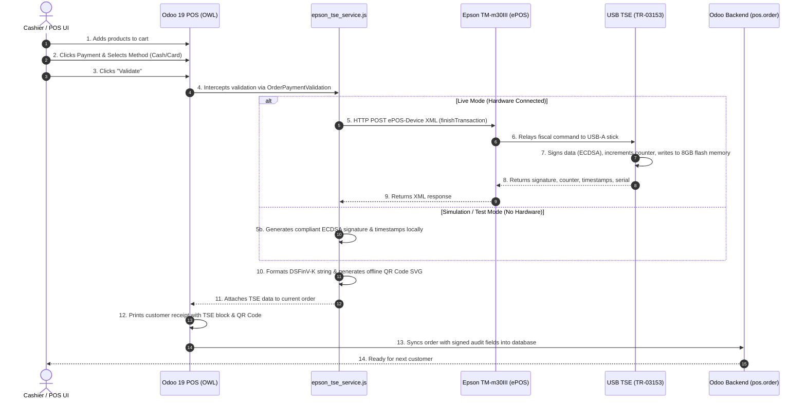

# Erzberger POS - Epson TM-m30III USB TSE
## Workflow, Configuration & Testing Guide

This document details the exact technical workflow, all configurations added to Odoo, and step-by-step testing instructions for the **`erzberger_pos_epson_tse`** module in Odoo 19.

---

## 1. System Architecture & Workflow

### 1.1 High-Level Interaction Diagram

---

### 1.2 The 6 Workflow Phases

1. **Cart Creation:**
   * Cashier adds products and customers as usual.
   * Odoo tracks start time and categorized VAT rates (19% standard, 7% reduced, 0% tax-free).
2. **Payment Interception:**
   * When the cashier clicks **Validate**, the module's patch in `OrderPaymentValidation` pauses the finalization.
3. **TSE Communication:**
   * The `epson_tse_service` structures the DSFinV-K data:
     * Format: `Beleg^<0%_amount>_<19%_amount>_<7%_amount>_0.00_0.00^<total>:<Zahlart>`
     * Example: `Beleg^0.00_119.00_0.00_0.00_0.00^119.00:Bar`
   * Sends the payload to the Epson TM-m30III via ePOS-Device XML on port `80` (or `8043`/`8009`).
4. **Cryptographic Signing & Flash Storage:**
   * The crypto-chip inside the Epson USB stick calculates the hash, chains it with the previous transaction's hash, generates an `ecdsa-plain-SHA256` signature, and increments the tamper-proof signature counter.
   * The full transaction log is saved directly to the **8 GB flash storage** inside the stick for future tax audits (Finanzamt Betriebsprüfung / DSFinV-K).
5. **Receipt Generation:**
   * The client renders the receipt with:
     * TSE Transaction Number
     * Signature Counter
     * TSE Serial Number (`U31630FE89C52BE8E5`)
     * Start and Stop Timestamps
     * Signature Value (Base64)
     * Offline-generated **KassenSichV QR-Code**
6. **Backend Persistence:**
   * The order is saved in Odoo with all TSE audit fields permanently stored on the `pos.order` database record.

---

## 2. Configurations Added to Odoo

The module adds configuration options in two locations:

### 2.1 Location 1: POS Register Settings (Point of Sale -> Configuration -> Point of Sale)
Open your POS register (e.g. "Shop" or "Main Cash Register"). Under the sheet, a new card named **Epson TM-m30III USB TSE (Germany KassenSichV)** is added:

| Field Name in Odoo UI | Technical Field | Default Value | Description & Recommendation |
| :--- | :--- | :--- | :--- |
| **Enable Epson USB TSE** | `l10n_de_epson_tse_enabled` | `False` | Turn **ON** to activate German TSE compliance with the Epson printer. |
| **Simulation / Test Mode** | `l10n_de_epson_tse_test_mode` | `False` | When **ON**, simulates valid TSE signatures in the browser. Perfect for testing without having the printer online. |
| **Printer / TSE IP Address** | `l10n_de_epson_tse_ip` | `192.168.1.100` | Enter the local IP address assigned to the Epson TM-m30III (e.g. `192.168.1.150`). |
| **Port** | `l10n_de_epson_tse_port` | `80` | Port for ePOS HTTP communication (`80` for standard HTTP, `8043` for HTTPS, or `8009` for TSE service). |
| **Protocol** | `l10n_de_epson_tse_protocol` | `HTTP` | `HTTP` (default) or `HTTPS` (if you installed an SSL certificate on the TM-m30III). |
| **Device ID** | `l10n_de_epson_tse_devid` | `local_printer` | Epson internal peripheral ID (standard: `local_printer`). |
| **Client ID (Kassen-ID)** | `l10n_de_epson_tse_client_id` | `POS-01` | Unique register ID registered on the TSE. |
| **TSE Serial / CDCID** | `l10n_de_epson_tse_serial` | `U31630FE89C52BE8E5` | The CDCID printed on your stick label (`*U31630FE89C52BE8E5*`). |
| **Test TSE Connection (Button)**| `action_test_epson_tse_connection` | *Action* | Pings the printer IP and tests the HTTP ePOS endpoint, showing a real-time status banner. |

### 2.2 Location 2: General Settings (Point of Sale -> Configuration -> Settings)
Under the **Point of Sale** section, a block named **Epson TM-m30III Hardware TSE (Germany)** is available to view and configure the same settings centrally.

### 2.3 Location 3: Backend Order View (Point of Sale -> Orders -> Orders)
Inside each order under the **Extra** tab, an **Epson USB TSE (Germany KassenSichV)** group displays:
* **TSE Status** badge: `Signed (Compliant)` (green), `Draft`, or `Error`.
* **TSE Transaction Number & Signature Counter**.
* **Start & End Timestamps**.
* **Full Cryptographic Signature & Public Key**.
* **Raw QR Code Data String**.

---

## 3. How to Test in Odoo

### Scenario A: Testing in Simulation Mode (No Hardware Required)
*Use this mode to test the entire POS flow immediately from any computer before connecting the physical printer.*

1. **Activate Test Mode:**
   * Go to **Point of Sale -> Configuration -> Point of Sale**.
   * Open your POS configuration (e.g. "Shop").
   * Scroll down to **Epson TM-m30III USB TSE**.
   * Check **Enable Epson USB TSE**.
   * Check **Simulation / Test Mode**.
   * Click **Save**.

2. **Open a POS Session:**
   * Go to **Point of Sale -> Dashboard**.
   * Click **New Session** (or **Continue Selling**).

3. **Complete a Sale:**
   * Add any product to the order (e.g. an item with 19% VAT).
   * Click **Payment**.
   * Choose payment method (e.g. **Cash** or **Bank**).
   * Click **Validate**.

4. **Verify the Receipt:**
   * On the receipt screen, you will see the **TSE-Signatur (KassenSichV)** block:
     * `TSE-Transaktion: 1`
     * `TSE-Signaturzähler: 100`
     * `TSE-Start` and `TSE-Stop`
     * `TSE-Seriennummer: U31630FE89C52BE8E5`
     * `Signatur: (Cryptographic hash)`
     * **Scannable QR-Code**
     * Red badge: `TEST-BELEG (TSE-SIMULATION)`
   * Click **Print Receipt** to verify the thermal receipt print layout.

5. **Verify the Backend Order:**
   * Close the session or open a new browser tab.
   * Go to **Point of Sale -> Orders -> Orders**.
   * Open the newly created order.
   * Go to the **Extra** tab: verify that `TSE Status` is **Signed (Compliant)** and all transaction fields are populated.

---

### Scenario B: Testing with Live Hardware (Epson TM-m30III + USB TSE Stick)

1. **Hardware Setup:**
   * Insert the **Epson USB TSE Stick** into the **USB-A port** on the Epson TM-m30III (under the interface cover).
   * Connect an **Ethernet (LAN) cable** from your router/switch to the printer.
   * Turn the printer **ON** using the power button.

2. **Obtain the Printer IP Address:**
   * With the printer turned on and paper loaded, locate the small **push button** on the rear interface panel.
   * Press and hold the button for **3 seconds**.
   * The printer prints a network status sheet containing:
     * **IP Address** (e.g. `192.168.1.150`)
     * **Subnet Mask** and **Gateway**
     * **MAC Address** (matches `A4D73CAA9352` from the label)

3. **Configure & Test Connection in Odoo:**
   * Go to **Point of Sale -> Configuration -> Point of Sale**.
   * Open your POS configuration.
   * In the **Epson TM-m30III USB TSE** section:
     * **Enable Epson USB TSE:** Checked.
     * **Simulation / Test Mode:** **Unchecked** (for live signing).
     * **Printer / TSE IP Address:** Enter the IP printed on the status sheet (e.g. `192.168.1.150`).
     * **Port:** `80`.
     * **Client ID:** `POS-01`.
   * Click the **Test TSE Connection** button at the top-right of the card.
   * You should see a green Odoo notification:
     > **Epson TM-m30III Reachable!**  
     > Successfully connected to 192.168.1.150:80! USB TSE hardware is ready.

4. **Live Transaction Test:**
   * Open your POS session.
   * Ring up a sale and click **Validate**.
   * The POS contacts the TM-m30III over the local network; the USB stick signs the transaction and saves it to its 8GB flash memory.
   * The thermal receipt prints with the official TSE signature block and QR code (without the test badge).
   * Scan the QR code using any smartphone QR scanner or German tax inspection app (*KassenSichV Scanner*): it decodes into the standard DSFinV-K string beginning with `V0;POS-01;Kassenbeleg-V1;...`.

---

## 4. Emergency & Offline Handling (§ 7 KassenSichV)

If the printer is powered off or disconnected during a transaction:
1. The POS displays a clear alert:
   > **Epson TSE Connection Error**  
   > Could not sign receipt with the Epson USB TSE.  
   > Printer IP: 192.168.1.150:80. Make sure the printer is powered on and the TSE stick is securely plugged in.
2. The cashier can reconnect the cable, power on the printer, and retry.
3. If hardware failure persists, business operations can continue legally in emergency mode under § 7 KassenSichV while the failure is documented.
